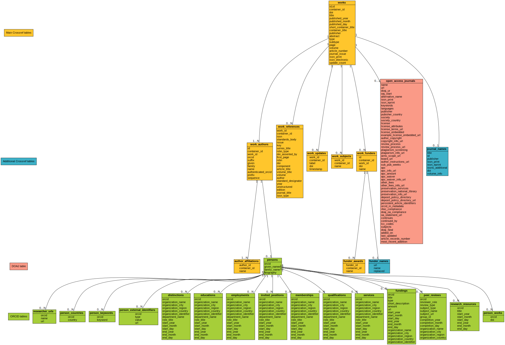

## Alexandria3k

The _alexandria3k_ package
supplies a library and a command-line tool providing efficient relational query
access the entire
[Crossref data set](https://www.nature.com/articles/d41586-022-02926-y)
(157 GB compressed, 1 TB uncompressed).
This contains publication metadata from about 134 million publications from
all major international publishers with full citation data for 60 million
of them.
The _alexandria3k_ package installation contains all elements required
to run it.
It does not require the installation, configuration, and maintenance
of a third party relational or graph database.
It can therefore be used out-of-the-box for performing reproducible
publication research on the desktop.

In addition,
the Crossref data set can be linked with
the [ORCID summary data set](https://support.orcid.org/hc/en-us/articles/360006897394-How-do-I-get-the-public-data-file-)
  (25 GB compressed, 435 GB uuncompressed),
  containing about 78 million author records, as well as
data sets of
funder bodies,
journal names,
open access journals,
and research organizations.

## Installation
The easiest way to install _alexandria3k_ and its dependencies is through
[PyPI](https://pypi.org/):
```sh
python3 -m pip install --use-pep517 alexandria3k
```
or
```sh
pip install --use-pep517 alexandria3k
```

## Data downloading

### Crossref data
The main data set on which _alexandria3k_ operates is that
of [Crossref](https://www.crossref.org), comprising about 130 million
publication metadata records with more than 1.7 billion reference
records and 359 million author records.
You can obtain the data from
[Acedemic Torrents](https://academictorrents.com/browse.php?search=crossref)
using a torrent client of your choice.
Below is an example of commands that download the April 2022 Crossref snapshot
(the one on which _alexandria3k_ has been tested) using the
[aria2c](https://aria2.github.io/) download utility.

```sh
# Download Crossref data (168 GB) through the torrent link
aria2c https://doi.org/10.13003/83b2gq
```

Currently, the Crossref data set is split into about 26 thousand compressed
files, each containing JSON data for 3000 publications (works).
_Alexandria3k_ provides a relational view of these data, and
also allows the sampling of a subset of the container files
to quickly experiment with queries, before they are run on the complete set.

### ORCID data
You can populate a database with data regarding authors (URLs, countries,
external identifiers, education, employment, works, etc.) from the
[ORCID](https://orcid.org/) initiative.
For this you need to download the _summary file_
of the ORCID Public Data File (e.g. `ORCID_2022_10_summaries.tar.gz` — 25GB)
through [Figshare](https://orcid.figshare.com/).
Note that _alexandria3k_ works on the compressed file;
there is no need to expand it (it expands to about 0.5 PB).

### Other data sources
The _alexandria3k_ system can also add to a database the following
tables.
You can download the data and point _alexandria3k_ to the corresponding file,
or, because the data sets are relatively small, you can provide _alexandria3k_
the URL from which it will directly stream the data to populate the database.

* [Crossref journal data](http://ftp.crossref.org/titlelist/titleFile.csv)
  (109k records)
* [Crossref funder data](https://doi.crossref.org/funderNames?mode=list)
  (21k records)
* [Open access journal metadata](https://doaj.org/csv)
  from the [directory of open access journals](https://doaj.org/)
  (19k records)
* [Research organization data](https://doi.org/10.5281/zenodo.7448410)
  from the [Research Organization Registry — ROR](https://ror.org/)
  (595k records)

## Use overview
After downloading the Crossref data you can use _alexandria3k_ through its
Python API or as a command-line tool.
These are the things you can do with _alexandria3k_.

* Directly run ad hoc SQL queries on the Crossref data
* Populate SQLite databases with Crossref, ORCID, DOAJ, and other data
  * Select a horizontal subset of Crossref records
    * Through an SQL expression
    * By sampling a subset of the 26 thousand containers in the data set
  * Select a horizontal subset of ORCID records by only loading those
    associated with already populated Crossref records
  * Select a vertical subset of Crossref or ORCID columns
    * Using the `Table.Column` or `Table.*` notation

Populating a database can take
minutes (for a small, e.g. experimental, subset),
a few hours (to traverse the whole Crossref data set and obtain a few thousands
of records),
or a couple of days (to produce a large set, e.g. by selecting some columns).

After your populate an SQLite database and create suitable indexes,
SQL queries often run in seconds.

## Relational schema
The complete schema of a fully-populated database appears below.
(Follow the linked image to the "Raw" file to see it in full size.)
Direct SQL queries can also be performed on the Crossref data set.



Queries involving multiple scans of the tables (e.g. relational joins)
should be performed by directing _alexandria3k_ to perform them separately
in each partition.
This however means that aggregation operations will not work as expected,
because they will be run multiple times (once for every partition).

## Command line execution

### Obtain list of command-line options
```sh
alexandria3k --help
```

### Show DOI and title of all publications
```sh
alexandria3k --data-source Crossref 'April 2022 Public Data File from Crossref' \
   --query 'SELECT DOI, title FROM works'
```

### Save DOI and title of 2021 publications in a CSV file suitable for Excel
```sh
alexandria3k --data-source Crossref 'April 2022 Public Data File from Crossref' \
  --query 'SELECT DOI, title FROM works WHERE published_year = 2021' \
  --output 2021.csv \
  --output-encoding use utf-8-sig
```

### Count Crossref publications by year and type
This query performs a single pass through the data set to obtain
the number of Crossref publications by year and publication type.
```sh
alexandria3k --data-source Crossref 'April 2022 Public Data File from Crossref' \
   --query-file count-year-type.sql >results.csv
```
where `count-year-type.sql` contains:
```sql
WITH counts AS (
  SELECT
    published_year AS year,
    type,
    Count(*) AS number
FROM   works
    GROUP by published_year, type)

SELECT year AS name, Sum(number) FROM counts
  GROUP BY year
UNION
SELECT type AS name, Sum(number) FROM counts
  GROUP BY type
```

### Sampling
The following command counts the number of publication that have
or do not have an abstract in an approximately 1% sample
of the data set's containers.
It uses a tab character ('\t') to separate the output fields.
Through sampling the data containers it runs in a couple of minutes,
rather than hours.
```sh
alexandria3k --data-source Crossref 'April 2022 Public Data File from Crossref'  \
   --sample 'random.random() < 0.01' \
   --field-separator $'\t' \
   --query-file count-no-abstract.sql
```
where `count-no-abstract.sql` contains:
```sql
SELECT works.abstract is not null AS have_abstract, Count(*)
  FROM works GROUP BY have_abstract
```

### Database of COVID research
The following command creates an SQLite database with all Crossref data
regarding publications that contain "COVID" in their title or abstract.
```sh
alexandria3k --data-source Crossref 'April 2022 Public Data File from Crossref' \
   --populate-db-path covid.db \
   --row-selection "title like '%COVID%' OR abstract like '%COVID%' "
```

### Publications graph
The following command selects only a subset of columns of the complete
Crossref data set to create a graph between navigable entities.
```sh
alexandria3k --data-source Crossref 'April 2022 Public Data File from Crossref' \
   --populate-db-path graph.db \
   --columns works.doi work_references.work_id work_references.doi work_funders.id \
    work_funders.work_id work_funders.doi funder_awards.funder_id funder_awards.name \
    author_affiliations.author_id author_affiliations.name work_subjects.work_id work_subjects.name \
    work_authors.id work_authors.work_id work_authors.orcid
```

Through this data set you can run on the database queries such as the following.
```sql
SELECT COUNT(*) FROM works;
SELECT COUNT(*) FROM (SELECT DISTINCT work_id FROM works_subjects);
SELECT COUNT(*) FROM (SELECT DISTINCT work_id FROM work_references);
SELECT COUNT(*) FROM affiliations_works;
SELECT COUNT(*) FROM (SELECT DISTINCT work_id FROM work_funders);

SELECT COUNT(*) FROM work_authors;
SELECT COUNT(*) FROM work_authors WHERE orcid is not null;
SELECT COUNT(*) FROM (SELECT DISTINCT orcid FROM work_authors);

SELECT COUNT(*) FROM authors_affiliations;
SELECT COUNT(*) FROM affiliation_names;

SELECT COUNT(*) FROM works_subjects;
SELECT COUNT(*) FROM subject_names;

SELECT COUNT(*) FROM work_funders;
SELECT COUNT(*) FROM funder_awards;

SELECT COUNT(*) FROM work_references;
```

### Populate the database with author records from ORCID
Only records of authors identified in the publications through an
ORCID will be added.
```sh
alexandria3k --populate-db-path database.db \
  --data-source ORCID ORCID_2022_10_summaries.tar.gz \
  --linked-records persons
```

### Populate the database with journal names
```sh
alexandria3k --populate-db-path database.db \
  --data-source journal-names http://ftp.crossref.org/titlelist/titleFile.csv
```

### Populate the database with funder names
```sh
alexandria3k --populate-db-path database.db \
  --data-source funder-names https://doi.crossref.org/funderNames?mode=list
```

### Work with Scopus All Science Journal Classification Codes (ASJC)
```sh
# Populate database with ASJCs
alexandria3k --populate-db-path database.db --data-source ASJC

# Link the (sometime previously populated works table) with ASJCs
alexandria3k --populate-db-path database.db --execute link-works-asjcs
```

### Populate the database with data regarding open access journals
```sh
alexandria3k --populate-db-path database.db \
  --data-source DOAJ https://doaj.org/csv
```

### Populate the database with the names of research organizations
Populate the research organization registry (ROR) tables.
```sh
# Fetch the ROR data file (~21 MB)
wget -O ror-v1.17.1.zip \
  "https://zenodo.org/record/7448410/files/v1.17.1-2022-12-16-ror-data.zip?download=1"

# Populate the database
alexandria3k --populate-db-path database.db \
  --data-source ROR ror-v1.17.1.zip
```

### Link author affiliations with research organization names
Given a database already populated with work author affiliations
and the research organization registry fill-in the table `work_authors_rors`
linking the two.
```sh
# Link affiliations with best match
alexandria3k --populate-db-path database.db --execute link-aa-base-ror

# Link affiliations with top parent of best match
alexandria3k --populate-db-path database.db --execute link-aa-top-ror
```

After linking, the results' quality can be verified with queries
such as the following.
```sql
-- Display affiliation matches
SELECT author_affiliations.name, research_organizations.name FROM
  work_authors
  INNER JOIN author_affiliations
    ON work_authors.id = author_affiliations.author_id
  INNER JOIN work_authors_rors
    ON work_authors_rors.work_author_id = work_authors.id
  INNER JOIN research_organizations
    ON research_organizations.id = work_authors_rors.ror_id;

-- Display unmatched affiliations
SELECT author_affiliations.name FROM
  work_authors
  INNER JOIN author_affiliations
    ON work_authors.id = author_affiliations.author_id
  LEFT JOIN work_authors_rors
    ON work_authors_rors.work_author_id = work_authors.id
  WHERE work_authors_rors.ror_id is null;
```

## Command-line options reference
<!-- CLI start -->
```
usage: alexandria3k [-h] [-c COLUMNS [COLUMNS ...]] [-D DEBUG [DEBUG ...]]
                    [-d DATA_SOURCE [DATA_SOURCE ...]] [-E OUTPUT_ENCODING]
                    [-F FIELD_SEPARATOR] [-H] [-i [INDEX ...]] [-L]
                    [-l LINKED_RECORDS] [-n] [-o OUTPUT] [-P]
                    [-p POPULATE_DB_PATH] [-Q QUERY_FILE] [-q QUERY]
                    [-R ROW_SELECTION_FILE] [-r ROW_SELECTION] [-s SAMPLE]
                    [-x EXECUTE]

alexandria3k: Publication metadata interface

optional arguments:
  -h, --help            show this help message and exit
  -c COLUMNS [COLUMNS ...], --columns COLUMNS [COLUMNS ...]
                        Columns to populate using table.column or table.*
  -D DEBUG [DEBUG ...], --debug DEBUG [DEBUG ...]
                        Output debuggging information as specfied by the
                        arguments. files-read: Output counts of data files
                        read; link: Record linking operations; log-sql: Output
                        executed SQL statements; perf: Output performance
                        timings; populated-counts: Dump counts of the
                        populated database; populated-data: Dump the data of
                        the populated database; populated-reports: Output
                        query results from the populated database; progress:
                        Report progress; stderr: Log to standard error;
                        virtual-counts: Dump counts of the virtual database;
                        virtual-data: Dump the data of the virtual database.
  -d DATA_SOURCE [DATA_SOURCE ...], --data-source DATA_SOURCE [DATA_SOURCE ...]
                        Specify data set to be processed and its source. The
                        following data sets are supported: ASJC [<CSV-file> |
                        <URL>] (defaults to internal table); Crossref
                        <container-directory>; DOAJ [<CSV-file> | <URL>]
                        (defaults to https://doaj.org/csv); funder-names
                        [<CSV-file> | <URL>] (defaults to
                        https://doi.crossref.org/funderNames?mode=list);
                        journal-names [<CSV-file> | <URL>] (defaults to
                        http://ftp.crossref.org/titlelist/titleFile.csv);
                        ORCID <summaries.tar.gz-file> ROR <zip-file>;
  -E OUTPUT_ENCODING, --output-encoding OUTPUT_ENCODING
                        Query output character encoding (use utf-8-sig for
                        Excel)
  -F FIELD_SEPARATOR, --field-separator FIELD_SEPARATOR
                        Character to use for separating query output fields
  -H, --header          Include a header in the query output
  -i [INDEX ...], --index [INDEX ...]
                        SQL expressions that select the populated rows
  -L, --list-schema     List the schema of the scanned database
  -l LINKED_RECORDS, --linked-records LINKED_RECORDS
                        Only add ORCID records that link to existing <persons>
                        or <works>
  -n, --normalize       Normalize relations in the populated Crossref database
  -o OUTPUT, --output OUTPUT
                        Output file for query results
  -P, --partition       Run the query over partitioned data slices. (Warning:
                        arguments are run per partition.)
  -p POPULATE_DB_PATH, --populate-db-path POPULATE_DB_PATH
                        Populate the SQLite database in the specified path
  -Q QUERY_FILE, --query-file QUERY_FILE
                        File containing query to run on the virtual tables
  -q QUERY, --query QUERY
                        Query to run on the virtual tables
  -R ROW_SELECTION_FILE, --row-selection-file ROW_SELECTION_FILE
                        File containing SQL expression that selects the
                        populated rows
  -r ROW_SELECTION, --row-selection ROW_SELECTION
                        SQL expression that selects the populated rows
  -s SAMPLE, --sample SAMPLE
                        Python expression to sample the Crossref tables (e.g.
                        random.random() < 0.0002)
  -x EXECUTE, --execute EXECUTE
                        Operation to execute on the data. This can be one of:
                        link-aa-base-ror (link author affiliations to base-
                        level research organizations); link-aa-top-ror (link
                        author affiliations to top-level research
                        organizations); link-works-asjcs (link works with
                        Scopus All Science Journal Classification Codes —
                        ASJCs).
```
<!-- CLI end -->

## Python API
After downloading the Crossref data, the functionality of _alexandria3k_
can be accessed through its Python API,
either interactively (for exploratory data analytics) or through
Python scripts (for long-running jobs and for documenting research methods
as repeatable processes).

### Create a Crossref object
Crossref functionality is accessed by means of a corresponding object
created by specifying the data directory.

```py
from alexandria3k.crossref import Crossref

crossref_instance = Crossref('April 2022 Public Data File from Crossref')
```

You can also add a parameter indicating how to sample the containers.
```py
from random import random, seed

from alexandria3k.crossref import Crossref

# Randomly (but deterministically) sample 1% of the containers
seed("alexandria3k")
crossref_instance = Crossref('April 2022 Public Data File from Crossref',
  lambda _name: random() < 0.01)
```

### Iterate through the DOI and title of all publications
```py
for (doi, title) in crossref_instance.query('SELECT DOI, title FROM works'):
    print(doi, title)
```

### Create a dictionary of which 2021 publications were funded by each body
Here `partition=True` is passed to the `query` method in order to
have the query run separately (and therefore efficiently) on each
Crossref data container.

```py
from collections import defaultdict

works_by_funder = defaultdict(list)

for (funder_doi, work_doi) in crossref_instance.query(
    """
   SELECT work_funders.doi, works.doi FROM works
       INNER JOIN work_funders on work_funders.work_id = works.id
       WHERE published_year = 2021
    """,
    partition=True,
):
    works_by_funder[funder_doi].append(work_doi)
```

### Database of COVID research
The following command creates an SQLite database with all Crossref data
regarding publications that contain "COVID" in their title or abstract.
```py
crossref_instance.populate(
    "covid.db", condition="title like '%COVID%' OR abstract like '%COVID%'"
)
```

### Reference graph
The following command populates an SQLite database by selecting only a subset
of columns of the complete Crossref data set to create a navigable graph
between publications and their references.
```py
crossref_instance.populate(
    "references.db",
    columns=[
        "works.id",
        "works.doi",
        "work_references.work_id",
        "work_references.doi",
    ],
    condition="work_references.doi is not null",
)
```

### Populate the database from ORCID
Add tables containing author country and education organization.
Only records of authors identified in the publications through an
ORCID will be added.
```py
from alexandria3k import orcid

orcid.populate(
    "ORCID_2022_10_summaries.tar.gz",
    "database.db",
    columns=[
        "person_countries.*",
        "person_educations.orcid",
        "person_educations.organization_name",
    ],
    authors_only=True,
    works_only=False
)
```

### Populate the database with journal names
```py
from alexandria3k import csv_sources

csv_sources.populate_journal_names(
    "database.db",
    "http://ftp.crossref.org/titlelist/titleFile.csv"
)
```

### Populate the database with funder names
```py
from alexandria3k import csv_sources

csv_sources.populate_funder_names(
    "database.db",
    "https://doi.crossref.org/funderNames?mode=list"
)
```

### Populate the database with data regarding open access journals
```py
from alexandria3k import csv_sources

csv_sources.populate_open_access_journals(
    "database.db",
    "https://doaj.org/csv"
)
```

### Work with Scopus All Science Journal Classification Codes (ASJC)
```py
from alexandria3k import csv_sources

# Populate database with ASJCs
csv_sources.populate_asjc("database.db", "resource:data/asjc.csv")

# Link the (sometime previously populated works table) with ASJCs
csv_sources.link_works_asjcs("database.db")
```

### Populate the database with the names of research organizations
```py
from alexandria3k import ror

ror.populate(
    "database.db",
    "v1.17.1-2022-12-16-ror-data.zip"
)
```

### Link author affiliations with research organization names
```py
from alexandria3k import ror

# Link affiliations with best match
ror.link_author_affiliations(args.populate_db_path, link_to_top=False)

# Link affiliations with top parent of best match
ror.link_author_affiliations(args.populate_db_path, link_to_top=True)
```

## Development
For software development purposes _alexandria3k_ can also be installed
and used through its
[Github repository](https://github.com/dspinellis/alexandria3k),
rather than as a Python package.

### Installation
```sh
git clone https://github.com/dspinellis/alexandria3k.git
cd alexandra3k/src
pipenv install
```

### CLI use while developing
```sh
# While in alexandria3k/src directory

# Install development dependencies
pipenv install --dev

# Launch a shell in the virtual environment
pipenv shell

# Navigate to the top directory
cd ..

# Run the CLI
bin/alexandria3k --help
```

### Testing
#### Python unit and integration tests
```sh
# While in the top-level directory
python3 -m unittest discover
```

#### SQL unit tests
To run SQL unit tests install [rdbunit](https://github.com/dspinellis/rdbunit)
and the [SQLite](https://www.sqlite.org/index.html) command-line tool.
```sh
# While in the top-level directory
for t in tests/*.rdbu; do rdbunit --database=sqlite $t | sqlite3 ; done
```

### Formatting
```sh
# While in the top-level directory
black -l 79 src/alexandria3k/*.py
```

### Linting
```sh
# While in the top-level directory
python -m pylint src/alexandria3k/*.py
```

### Building
```sh
# While in the top-level directory
python3 -m build
```

## Package name derivation
The _alexandria3k_ package is named after the
[Library of Alexandria](https://en.wikipedia.org/wiki/Library_of_Alexandria),
indicating how publication data can be processed in the third millenium AD.
