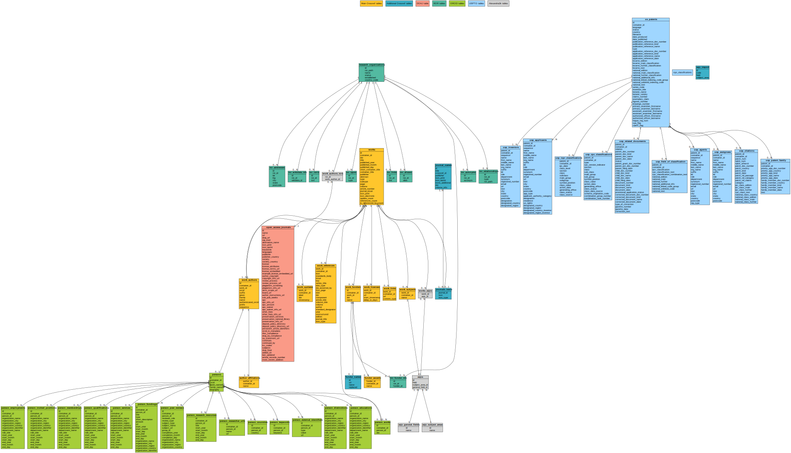
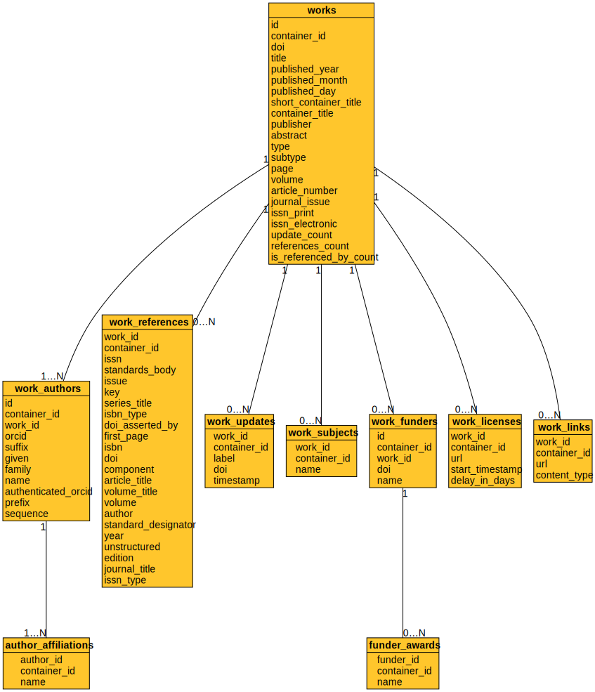
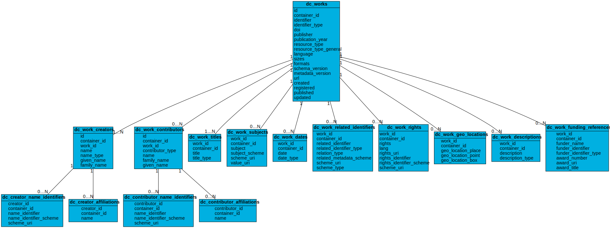
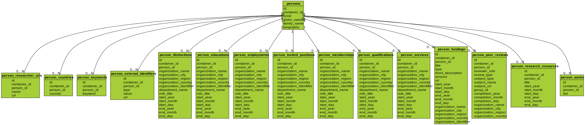
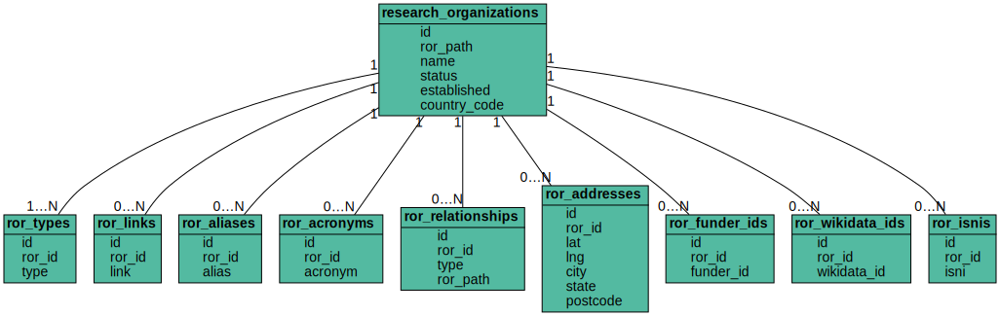
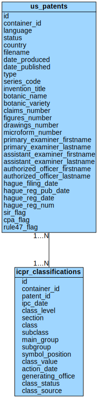

Schema diagrams
---------------

The complete schema of a fully-populated database appears below.
Opening the image in a separate window will allow you to zoom it.

In addition,
direct SQL queries can be performed on each data source's tables.
Queries involving multiple scans of the tables (e.g. relational joins)
should be performed by directing *alexandria3k* to perform them
separately in each partition. This however means that aggregation
operations will not work as expected, because they will be run multiple
times (once for every partition).

Crossref data
~~~~~~~~~~~~~

Crossref data concern published works, identified through their DOI.

DataCite data
~~~~~~~~~~~~~

DataCite data concern published data, identified through their DOI.

ORCID data
~~~~~~~~~~

ORCID data concern work authors, identified through their ORCID.

PubMed data
~~~~~~~~~~~

PubMed data concern citations from the biomedical literature also
identified through their DOI,

.. figure:: ./schema/pubmed.svg
   :alt: PubMed data schema

ROR data
~~~~~~~~

ROR data concern research organizations, identified through their DOI.

USPTO data
~~~~~~~~~~

USPTO data are the metadata of US Patent Office granted patents.

Other data
~~~~~~~~~~

Other data include journal names, subjects (ASJCS), funders, and
open access journals, as well as join tables created through
available processing steps.

.. figure:: ./schema/other.svg
   :alt: Other data schema
