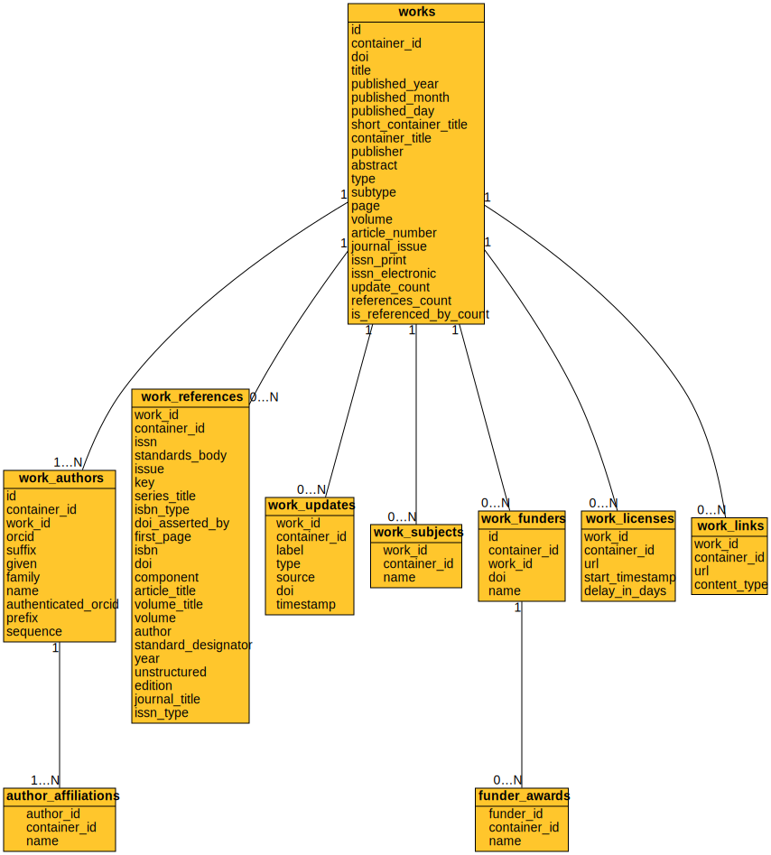

Relational schemas
------------------

The complete schema of a fully-populated database appears below.
Opening the image in a separate window will allow you to zoom it.

Direct SQL queries can also be performed on the Crossref data set.

.. figure:: ./schema/all.svg
   :alt: Complete data schema

Queries involving multiple scans of the tables (e.g. relational joins)
should be performed by directing *alexandria3k* to perform them
separately in each partition. This however means that aggregation
operations will not work as expected, because they will be run multiple
times (once for every partition).

Crossref data
~~~~~~~~~~~~~

Crossref data concern works, identified through their DOI.

ORCID data
~~~~~~~~~~

ORCID data concern work authors, identified through their ORCID.

ROR data
~~~~~~~~

ROR data concern research organizations, identified through their DOI.

Other data
~~~~~~~~~~

Other data include journal names, subjects (ASJCS), funders, and
open access journals.

.. figure:: ./schema/other.svg
   :alt: Other data schema
