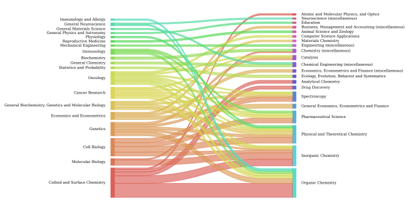
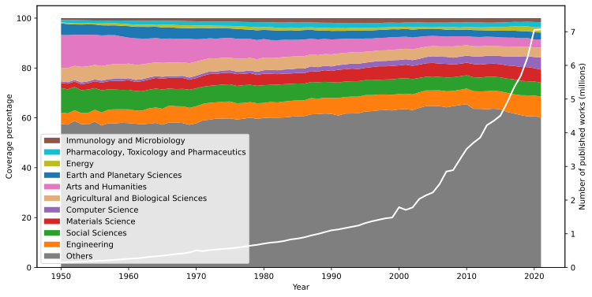

# Generate and study the entities' graph structure

Generate a vertical slice of the complete Crossref data containing
mostly linked entities, rather than text data.
Based on it, calculate metrics associated with the Crossref data set,
the evolution in the number of publications in different fields
over time, and
citation patterns between fields.

## Strong relationships between citing and cited subjects

## Evolution of publications and subject coverage by general field

