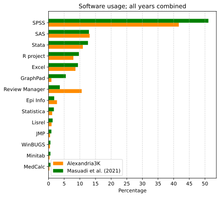

# PubMed software tool usage

This example is a replication study on the use of software tools
in PubMed over a sample of three years.
The result is compared to the following original bibliometric analysis

Masuadi E, Mohamud M, Almutairi M, et al. (January 11, 2021)
Trends in the Usage of Statistical Software and Their Associated Study Designs in Health Sciences Research: A Bibliometric Analysis.
_Cureus_ 13(1): e12639.
doi:[10.7759/cureus.12639](https://doi.org/10.7759/cureus.12639)

