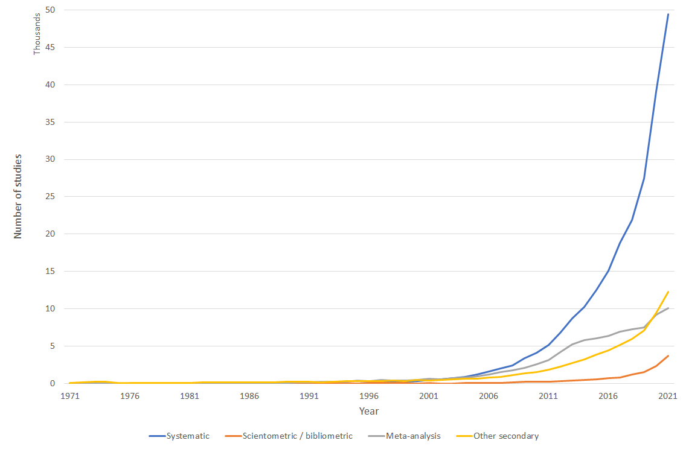

# Studies employing research synthesis methods

Obtain the number of studies that employ diverse research synthesis methods published each year.
The provided SQL query does not perform any joins, and is therefore run directly on the Crossref data repository,
without requiring partitioning or populating a separate database.

